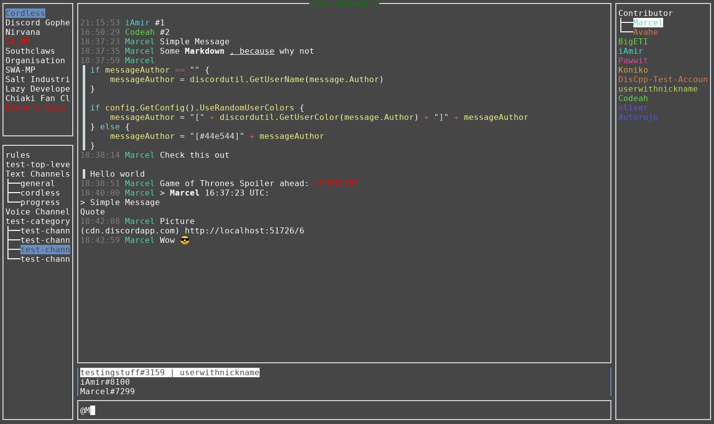

<h1 align="center">Cordless</h1>

<p align="center">
  <a href="https://circleci.com/gh/Bios-Marcel/cordless">
    
  </a>
  <a href="https://travis-ci.org/Bios-Marcel/cordless">
    
  </a>
  <a href="https://ci.appveyor.com/project/Bios-Marcel/cordless/branch/master">
    
  </a>
  <a href="https://codecov.io/gh/Bios-Marcel/cordless">
     
  </a>
  <a href="https://discord.gg/fxFqszu">
     
  </a>
</p>

## Overview

- [Credits](#credits)
- [How to install it](#installation)
  - [Building from source](#building-from-source)
  - [Installing on Linux](#installing-on-linux)
  - [Installing on Windows](#installing-on-windows)
  - [Installing on macOS](#installing-on-macos)
- [Login](#login)
- [Quick overview - Navigation (switching between boxes / containers)](#quick-overview---navigation-switching-between-boxes--containers)
- [Extending Cordless via the scripting interface](#extending-cordless-via-the-scripting-interface)
- [Contributing](#contributing)
- [This project isn't for you, if](#this-project-isnt-for-you-if)
- [Similar projects](#similar-projects)
- [Troubleshooting](#troubleshooting)

**WARNING: Third party clients are discouraged and against the Discord TOS.**

Cordless is a custom [Discord](https://discordapp.com) client that aims to
have a low memory footprint and be aimed at power-users.

The application only uses the official Discord API and doesn't send data to
third parties. However, this application is not an official product by
Discord Inc.



## Installation

### Using prebuilt binaries

If you don't want to build the application yourself or use some kind of
package management system, you can get the latest binaries for the three
major systems in the release overview:

https://github.com/Bios-Marcel/cordless/releases/latest

### Building from source

In order to execute the following commands, you need to install **go 1.13 or**
higher. You can find golang packages at https://golang.org/doc/install.
On top of that, you need to have **git** installed. It can be fund at
https://git-scm.com/downloads.

**UPDATES HAVE TO BE INSTALLED MANUALLY**

Open a command line and execute the following commands:

```shell
git clone https://github.com/Bios-Marcel/cordless.git
cd cordless
go build
```

This will create an executable file called `cordless` or `cordless.exe`
depending on whether you are on Windows or not. Move that file anywhere
that your terminal can find it. I recommend adding a `bin` folder to your
user home and adding it to your systems `PATH` variable. Please search the
internet, using your favourite search engine, for
`how to set an environment variable in XXX` in order to update your `PATH`
variable correctly.

For updateing you simply have to delete the folder you downloaded last
time and repeat the instructions.

Note:

* X11 users need `xclip` in order to copy and paste.
* Wayland users need `wl-clipboard` in order to copy and paste.
* Mac OS users need `pngpaste` in order to copy and paste images.

### Installing on Linux

#### Snap

**Currently I can't release new snap versions due to a bug!**

Run (Might require sudo):

```shell
snap install cordless
```

Snap will automatically install updates.

#### Arch based Linux distributions

On Arch based distributions, you can use the AUR package to install cordless:

```shell
git clone https://aur.archlinux.org/cordless-git.git
cd cordless-git
makepkg -sric
```

or use your favourite AUR helper.

### Installing on Windows

In order to install the latest version on Windows, you first need to install
[scoop](https://scoop.sh/#installs-in-seconds).

After installing scoop, run the following:

This adds the bucket (repository) that contains cordless to your local scoop
installation, allowing you to install any package it contains. Afterwards
it installs cordless for your current windows user.

```ps1
scoop bucket add biosmarcel https://github.com/Bios-Marcel/scoopbucket.git
scoop install cordless
```

Updates can be installed via:

```ps1
scoop update cordless
```

### Installing on macOS

Use [Homebrew](https://brew.sh) to install `cordless` on macOS:

```shell
brew tap Bios-Marcel/cordless
brew install cordless
```

If you don't install via cordless via brew, then you should have to get
`pngpaste` in order to be able to paste image data.

### Login

**YOUR PASSWORD IS NEVER SAVED LOCALLY.**

Logging in works via the UI on first startup of the application.

If you are logging in with a bot token, you have to prepend `Bot` in front of
the token.

If you need to find out how to retrieve your token, check [the wiki](https://github.com/Bios-Marcel/cordless/wiki/Retrieving-your-token).

**Currently captcha-code login isn't supported. Thanks for your SHIT-API, Google**

## Quick overview - Navigation (switching between boxes / containers)

| Shortcut | Action |
| - |:- |
| <kbd>Alt</kbd> + <kbd>S</kbd> | Sets the focus on the servers (guilds) container |
| <kbd>Alt</kbd> + <kbd>C</kbd> | Sets the focus on the channels container |
| <kbd>Alt</kbd> + <kbd>T</kbd> | Sets the focus on the messages container |
| <kbd>Alt</kbd> + <kbd>M</kbd> | Sets the focus on the messages input field |
| <kbd>Alt</kbd> + <kbd>U</kbd> | Sets the focus on the users container |
| <kbd>Alt</kbd> + <kbd>P</kbd> | Opens the direct messages container |
| <kbd>Alt</kbd> + <kbd>.</kbd> | Toggles the internal console view |

Further shortcuts / key-bindings can be found in the manual on the internal
console with the command `manual`.

If any of the default commands don't work for you, open the keyboard shortcut
changer via <kbd>Ctrl</kbd> + <kbd>K</kbd>.

## Extending Cordless via the scripting interface

[Check the wiki](https://github.com/Bios-Marcel/cordless/wiki/Extending-Cordless-via-the-scripting-interface)

## Troubleshooting

If you happen to encounter a crash or a bug, please submit a bug report via
the projects GitHub issue tracker. Bugs reported via Discord will probably
be forgotten or overseen.

For general problems faced by cordless users, check out the wiki at:
https://github.com/Bios-Marcel/cordless/wiki/Troubleshooting

If you need help or have questions that you don't want to create an issue
for, just join our Discord server: https://discord.gg/fxFqszu

# FAQ

In order to find answers to common questions, check out the FAQ in the wiki:

https://github.com/Bios-Marcel/cordless/wiki/FAQ

## This project isn't for you, if

- You like fancy GUI
- You want to see images, videos and whatnot inside of the application itself
- You need the voice/video calling features
- You need to manage or moderate servers

## Contributing

All kinds of contributions are welcome. Whether it's correcting typos, fixing
bugs, adding features or whatever else might be good for the project. If you
want to contribute code, please create a new branch and commit only changes
relevant to your planned pull request onto that branch. This will help
to isolate new changes and make merging those into `master` easier.

If you encounter any issues, whether it's bugs or the lack of certain features,
don't hesitate to create a new GitHub issue.

If there are specific issues you want to be solved quickly, you can set a
bounty on those via [IssueHunt](https://issuehunt.io/r/Bios-Marcel/cordless).
The full 100% of the bounty goes to whoever solves the issue, no matter
whether that's me or someone else.

## Similar projects

Here is a list of similar projects:

- [terminal-discord](https://github.com/xynxynxyn/terminal-discord)
- [Discurses](https://github.com/topisani/Discurses)
- [Discline](https://github.com/MitchWeaver/Discline)
- [discord-term](https://github.com/cloudrex/discord-term)
- [6cord](https://gitlab.com/diamondburned/6cord)

Hit me up if you have a similar project, and I'll gladly add it to the list.

## Credits

Big thanks to [JetBrains](https://www.jetbrains.com/?from=cordless) for providing the
cordless project with free licenses!

This project was mainly inspired by [Southclaws](https://github.com/Southclaws)
[Cordless](https://github.com/Southclaws/cordless-old), which he sadly didn't
develop any further.
